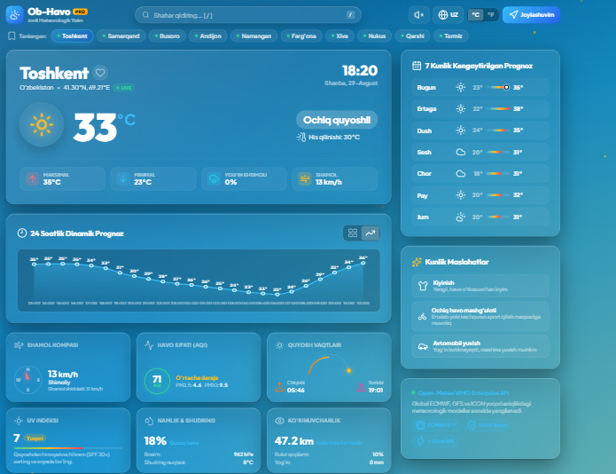
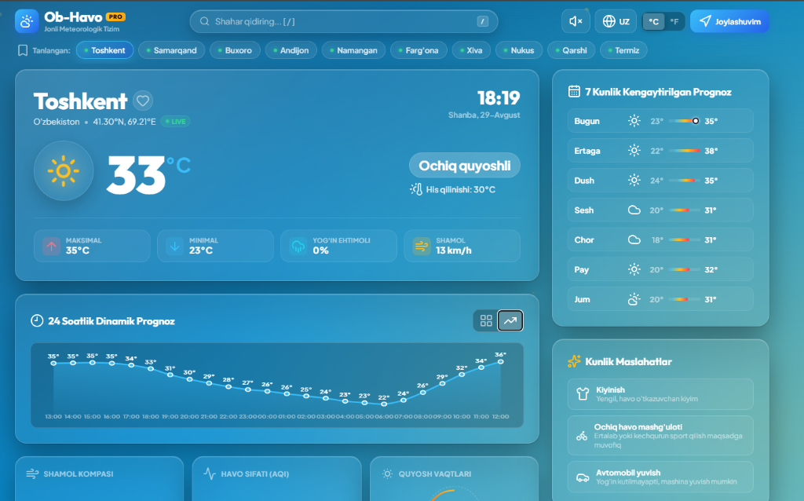
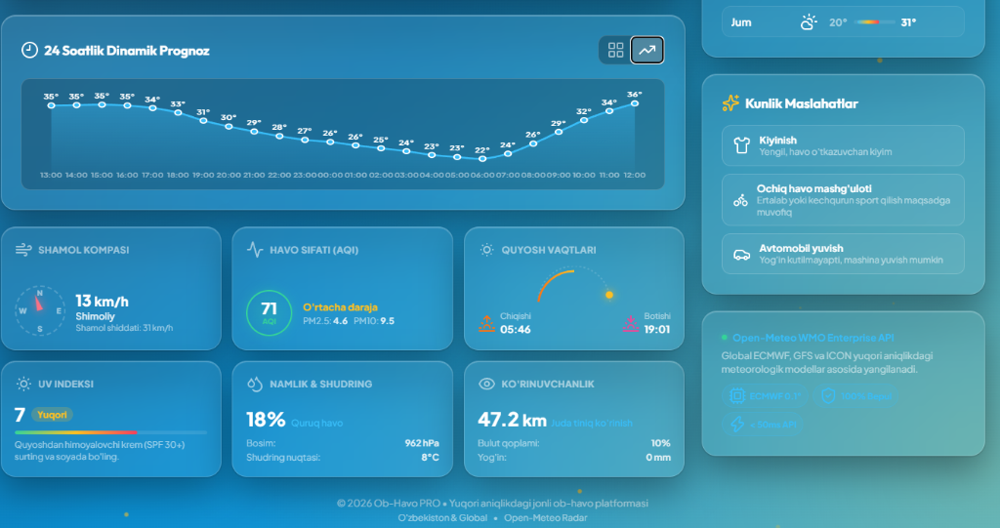

# 🌤️ Ob-Havo PRO — Ultra Zamonaviy Jonli Ob-Havo Platformasi

> Apple Weather, Linear va zamonaviy Glassmorphism dizayn tizimi asosida yaratilgan, rasmiy **Open-Meteo Forecast & Air Quality API** integratsiyasiga ega eng so'nggi avlod ob-havo veb-platformasi.

---

## 📸 Loyiha Ko'rinishi (Screenshots)

### 🖥️ Asosiy Dashboard (To'liq Ko'rinish)


---

### ☀️ Joriy Ob-Havo, Qidiruv va 7 Kunlik Kengaytirilgan Prognoz


---

### 📊 24 Soatlik Trend Grafigi, Shamol Kompasi, AQI va Atmosfera Ko'rsatkichlari


---

## 💎 Asosiy Imkoniyatlar va Funksiyalar

1. 🎨 **Apple Weather Uslubidagi Glassmorphism Dizayni**:
   - Ko'p qatlamli shishasimon (Frosted Glass) yuzalar, nozik yorug'lik chegaralari va mikro-animatsiyalar.
   - Ob-havo holatiga qarab (ochiq quyoshli, bulutli, yomg'irli, qorli, momaqaldiroq, tuman, yulduzli tun) avtomatik o'zgaruvchi gradientlar.

2. 🌧️ **Dinamik Atmosfera Kanvasi (HTML5 Canvas Engine)**:
   - Haqiqiy vaqt rejimida harakatlanuvchi animatsiyalar: yomg'ir tomchilari, qor parchalari, yulduzlar miltillashi, quyosh nurlari va chaqmoq chaqnashlari.

3. 📈 **Interaktiv 24 Soatlik Dinamik Grafik & Kartalar**:
   - 24 soatlik harorat o'zgarishini kartalar yoki **silliq SVG chiziqli grafik** (Spline curve) holatida ko'rish imkoniyati.

4. 📊 **7 Kunlik Harorat Diapazoni (Apple Style Range Bars)**:
   - Hafta kunlari bo'yicha rangli harorat shkalasi (sovuqdan issiqqa o'tuvchi gradient va bugungi harorat nuqtasi).

5. 🍃 **Havo Sifati Indeksi (AQI - Air Quality)**:
   - Jonli **PM2.5, PM10, AQI** darajasi va salomatlik uchun foydali maslahatlar.

6. 🧭 **3D Shamol Radari & Kompasi**:
   - Shamol tezligi (km/soat), shamol shiddati (gusts) va haqiqiy burchak bo'yicha silliq aylanuvchi dinamik kompas strelkasi.

7. ☀️ **Quyosh & Kun Davomiyligi Arki**:
   - Quyosh chiqishi, botishi va kun davomidagi aniq harakat trayektoriyasi.

8. 🔊 **Atmosfera Tovushlari (Web Audio API Synthesizer)**:
   - Ob-havo muhitiga mos sokinlashtiruvchi shamol va yomg'ir ovozi generatori (qo'shimcha audio fayllarsiz to'g'ridan-to'g'ri brauzerda hosil qilinadi).

9. 🌐 **3 Tilli Tizim (Multi-Language)**:
   - O'zbekcha (UZ), Ruscha (RU) va Inglizcha (EN) tillarida bir bosishda to'liq yangilanish.

10. ⚡ **Tezkor Qidiruv va Sevimlilar**:
    - Klaviaturadan `/` tugmasini bosib qidiruvni ochish, avtomatik takliflar.
    - ❤️ Sevimli shaharlarni tanlash va xotirada (**LocalStorage**) saqlash.

---

## 🚀 Integratsiya qilingan API Manbalari

Loyiha rasmiy **[Open-Meteo](https://open-meteo.com/)** xizmatlaridan foydalanadi:

- **Forecast API**: `https://api.open-meteo.com/v1/forecast` (Real vaqt ob-havosi, soatlik va 7 kunlik prognoz)
- **Air Quality API**: `https://air-quality-api.open-meteo.com/v1/air-quality` (AQI, PM2.5, PM10)
- **Geocoding API**: `https://geocoding-api.open-meteo.com/v1/search` (Dunyo va O'zbekiston shaharlari qidiruvi)
- **Afzalligi**: Hech qanday API Key talab qilinmaydi, 100% bepul va cheklovlarsiz ishlaydi.

---

## 💻 Qanday Ishga Tushiriladi?

### 1. Loyihani yuklab olish (Clone):
```bash
git clone https://github.com/a-norimboyev/Ob_Havo.git
cd Ob_Havo
```

### 2. Brauzerda ochish:
- `index.html` faylini istalgan zamonaviy brauzerda (Chrome, Edge, Safari, Firefox) oching.
- Yoki VS Code ichida **Live Server** kengaytmasi orqali ishga tushiring.

### 3. Lokal server orqali ishga tushirish (ixtiyoriy):
```bash
python -m http.server 8000
```
Brauzerda quyidagi manzilga kiring:
```text
http://localhost:8000/
```

---

## 📁 Fayllar Strukturasi

```
Ob_Havo-main/
│
├── screenshots/               # Loyiha skrinshotlari
│   ├── dashboard-full.png     # To'liq interfeys ko'rinishi
│   ├── hero-forecast.png      # Asosiy ob-havo va 7 kunlik prognoz
│   └── metrics-chart.png      # Soatlik grafik va atmosfera metrikalari
│
├── index.html                 # Asosiy HTML5 semantik strukturasi
├── style.css                  # Glassmorphism dizayn va 100% responsiv CSS
├── app.js                     # Open-Meteo API, audio sintez va kanvas dvigateli
└── README.md                  # Loyiha to'liq hujjati
```

---

## 🧩 Texnologiyalar

- **HTML5 & CSS3** (Glassmorphism, CSS Grid, Flexbox, Clamp)
- **JavaScript (ES6+)** (Async/Await, Geolocation API, Web Audio API)
- **HTML5 Canvas** (Atmosfera zarrachalar dvigateli)
- **Lucide Icons** (Zamonaviy vektorli ikonalar)
- **Open-Meteo API** (Meteorologik ma'lumotlar manbasi)

---

## 👤 Muallif

- **GitHub**: [@a-norimboyev](https://github.com/a-norimboyev)
- **Loyiha Repository**: [https://github.com/a-norimboyev/Ob_Havo.git](https://github.com/a-norimboyev/Ob_Havo.git)
